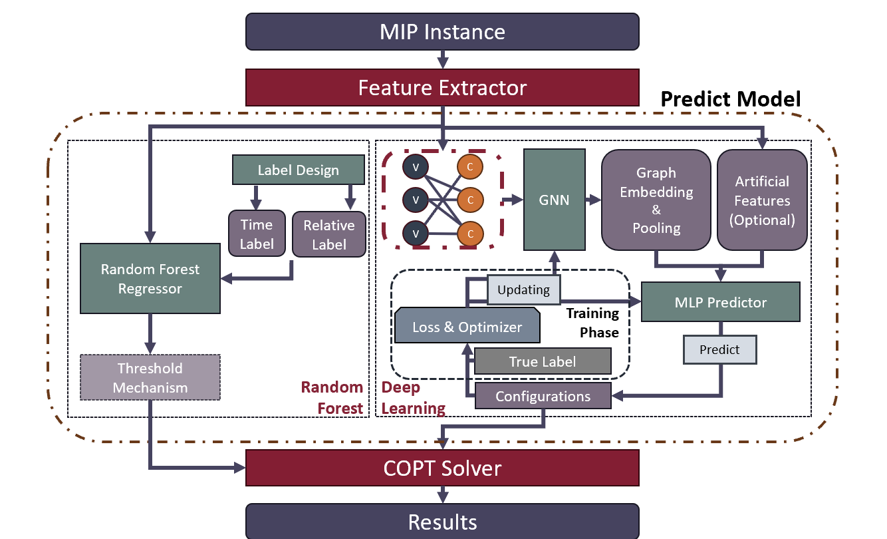

# BenLOC: A Benchmark of Learning to MIP Optimizer Configuration.


The `ML4MOC` class is designed to facilitate the training and evaluation of machine learning models for optimization problems. It provides methods for data preprocessing, model selection, training, and evaluation. Below is a step-by-step guide on how to use the class:

## Datasets

See `ml4moc/data/dataset.md` for the introduction.

## WorkFlow: 



## BenLOC: Machine Learning API

### 1. **Setting Parameters**

The parameters for the `ML4MOC` class can be set during initialization. You can either pass a `Params` object or use the default parameters.

```python
from ml4moc import TabParams
params = TabParams(default="MipLogLevel-2", label_type="log_scaled", shift_scale=10)
model = ML4MOC(params)
```

- **label_type**: Specifies whether the labels are scaled (`log_scaled`) or in their original form (`original`).
- **default**: The column name representing the default time in the dataset.
- **shift_scale**: The scale used for the geometric mean during the baseline calculation.

---

### 2. **Setting the Learner (Model)**

You can set a model (e.g., `RandomForestRegressor`) as the trainer for the `ML4MOC` class using the `set_trainner` method.

```python
from sklearn.ensemble import RandomForestRegressor
model.set_trainner(RandomForestRegressor(verbose=1))
```

- **RandomForestRegressor**: A random forest regressor model is used as the default estimator for the training process. You can also use other sklearn estimators, such as `LinearRegression`, `SVR`, etc. 
- If you want to adapt customized estimator, please provide APIs of `model.fit()` and `model.predict()` just like sklearn's APIs.

---

### 3. **Setting the Dataset**

You can set our datasets or input your datasets.

#### Loading Provided labeled Datasets

You can load a dataset using the `load_dataset` method. The dataset will include both features and labels, and can be processed optionally.

```python
model.load_dataset("setcover", processed=True, verbose=True)
```

- **dataset**: The dataset to be loaded (e.g., `setcover`, `indset`, `nn_verification`, etc.).
- **processed**: If set to `True`, it loads the processed version of the dataset.
- **verbose**: If set to `True`, it prints information about the dataset.

After loading the dataset, the `feat` (features) and `label` (labels) are stored, and preprocessing can be applied as needed.

#### Input Datasets

```python
model.set_train_data(Feature, Label)
#model.set_test_data(Test_Feature, Test_Label) (OPTIONAL)
```

Both `Feature` and `Label` should be the type of `pandas.DataFrame`. Please follow our formats!

*If you want use `model.evaluation`, you can either set test datasets or only set train datasets and use train-test-split.*

---

### 4. **Train-Test Split**

*If you have set test dataset, please skip this step.*

To split the dataset into training and testing sets, you can use the `train_test_split` method.

```python
model.train_test_split(test_size)
```

- **test_size**: Fraction of the data to be used as the test set (e.g., `0.2` means 20% for testing, 80% for training).

This will divide the features and labels into training and testing sets and preprocess the data accordingly.

Also, you can use lists including the partition to split train and test datasets.

```python
model.train_test_split_by_name(train_subset_names, test_subset_names)
```

---

### 5. **Fitting the Model**

Once the dataset is loaded and the model is set, you can fit the model using the `fit` method.

```python
model.fit()
```

The `fit` method will train the model using the processed features (`X`) and labels (`Y`).

- The model is trained on the processed training data using the `trainner` model set earlier.

---

### 6. **Evaluating the Model**

After training, you can evaluate the model using the `evaluate` method. This method will make predictions on both the training and testing datasets and return a DataFrame with evaluation results.

```python
evaluation_results = model.evaluate()
```

- **evaluation_results**: A DataFrame containing the evaluation results, including the baseline, default time, model prediction time, and oracle performance for both training and testing datasets.

The evaluation method returns the following columns:

- **baseline_name**: Name of the baseline method used.
- **default_time**: Default time using the baseline method.
- **baseline_time**: Time predicted by the baseline method.
- **rf_time**: Time predicted by the random forest model.
- **ipv_default**: The improvement in performance relative to the baseline (train).
- **ipv_baseline**: The improvement in performance relative to the baseline (test).
- **oracle**: The optimal oracle time.
- **ipv_oracle**: The improvement relative to the oracle.

---

### **Estimator Parameters Selection** (Optional)

we support use sklearn's model-selection methods to select parameters.

```python
model.cross_validation(CVer, parameters_space log_name)
```

if you use `RandomForest`, `LightGBM` or `GBDT`, we will support our parameters space as default.

Use following commands to check our parameters space.

```python
model.rfr_parameter_space
model.lgbm_parameter_space
model.gbdt_parameter_space
```

### Example Usage Flow

```python
# Step 1: Initialize the model with parameters
from ml4moc.params import Params
params = Params(default="MipLogLevel-2", label_type="log_scaled", shift_scale=10)
model = ML4MOC(params)

# Step 2: Set the machine learning model (e.g., Random Forest)
from sklearn.ensemble import RandomForestRegressor
model.set_trainner(RandomForestRegressor(verbose=1))

# Step 3: Load the dataset and preprocess
model.load_dataset("setcover", processed=True, verbose=True)

# Step 4: Split the dataset into training and test sets
model.train_test_split(test_size=0.2)

# Step 5: Train the model
model.fit()

# Step 6: Evaluate the model and get results
evaluation_results = model.evaluate()

# Output evaluation results
print(evaluation_results)
```

## BenLOC: Deep Learning Methods

### **1. Set Up the Environment**

Before running the script, ensure the following:
- Required packages (e.g., PyTorch, wandb, etc.) are installed.
- Your dataset is prepared and accessible.
- Set up the directory for saving models and results.

---

### **2. Define Parameters**

Create a `params` object to store the configurations required for training. These include paths, training hyperparameters, and model settings.

```python
params = {
    "use_wandb": True,                  # Enable wandb logging
    "modeGNN": "GAT",                   # Type of GNN to use (e.g., "GAT", "GCN")
    "fold": 2,                          # Fold for cross-validation
    "reproData": False,                 # Enable reproducibility
    "default_index": 7,                 # Default problem index
    "report_root_path": "repo/reports", # Path for reports
    "problem_root_path": "./data",      # Path to problem data
    "batchsize": 32,                    # Batch size for training
    "epoch": 100,                       # Number of training epochs
    "lr": 0.001,                        # Learning rate
    "stepsize": 10,                     # Step size for LR scheduler
    "gamma": 0.9,                       # Gamma for LR scheduler
    "save_model_path": "./models",      # Directory to save models
    "result_root_path": "./results",    # Directory to save results
    "nn_config": {                      # Model-specific configurations
        "hidden_dim": 64,
        "num_heads": 8,
    },
    "seed": 42                          # Random seed for reproducibility
}
```

---

### **3. Create the Trainer Instance**

Initialize the `GNNTrainer` with the defined parameters.

```python
trainer = GNNTrainer(params)
```

If you want to customize model, you can set your model by:

```python
trainer.set_model(YOUR_MODEL)
```

---

### **4. Set Up the Training Environment**

Configure seeds and initialize wandb if enabled. Run this step to ensure consistent results across runs.

```python
trainer.setup_environment()
```

---

### **5. Load and Prepare the Dataset**

Load your dataset and split it into training, validation, and test sets. Dataloaders are prepared internally.

```python
trainer.load_data()
```

---

### **6. Build the Model**

Initialize the GNN model, optimizer, and scheduler. Ensure the model is set to the appropriate device (CPU/GPU).

```python
trainer.build_model()
```

---

### **7. Train and Validate the Model**

Train the model for the specified number of epochs and validate performance at the end of each epoch. The best model is saved automatically.

```python
trainer.train_and_evaluate()
```

---

### **8. Test the Model**

Evaluate the final model on the test dataset and print or save the results.

```python
test_results = trainer.test_model()
print("Test Results:", test_results)
```

---

### **9. Save Results**

Save the results of training and testing to a specified directory for further analysis.

```python
trainer.save_results()
```

---

### **10. Run the Entire Pipeline**

For convenience, you can call the `run` method, which executes all the above steps sequentially.

```python
trainer.run()
```

---

### **Example Full Script**

```python
# Import necessary libraries
from trainer import GNNTrainer  # Assuming your trainer is saved as trainer.py

# Define parameters
params = {
    "use_wandb": True,
    "modeGNN": "GAT",
    "fold": 2,
    "reproData": False,
    "default_index": 7,
    "report_root_path": "repo/reports",
    "problem_root_path": "./data",
    "batchsize": 32,
    "epoch": 100,
    "lr": 0.001,
    "stepsize": 10,
    "gamma": 0.9,
    "save_model_path": "./models",
    "result_root_path": "./results",
    "nn_config": {
        "hidden_dim": 64,
        "num_heads": 8,
    },
    "seed": 42,
}

# Initialize and run the trainer
trainer = GNNTrainer(params)
trainer.run()
```
## Reference

- https://github.com/dreamquark-ai/tabnet

- https://github.com/lucidrains/hyper-connections/tree/main

- https://github.com/Lightning-AI/pytorch-lightning
